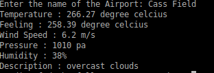
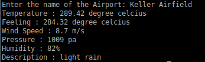

# WeatherAPI-E1visz
WeatherAPI-E1visz created by GitHub Classroom

## Project Mission

Provide the realtime weather of the airport, which contains the temperature, feels like, humidity, pressure, etc.

## User stories

I, as a traveler, would like to use this API to get the weather information of the airport to make sure the journey goes well.   

I, as a ground crew, would like to use this API to get the weather imformation of the airport in case of the negative influence of the bad weather.   

## Test Case

1. I, as a ground crew in Cass Field, I want to know whether today's weather is good for airplane to take off.

2. I, as a traver, will fly from Colberg Airport to Keller Airfield today and I want to know the weather in these two airports is good for taking off or landing.

## Lessons Learned
